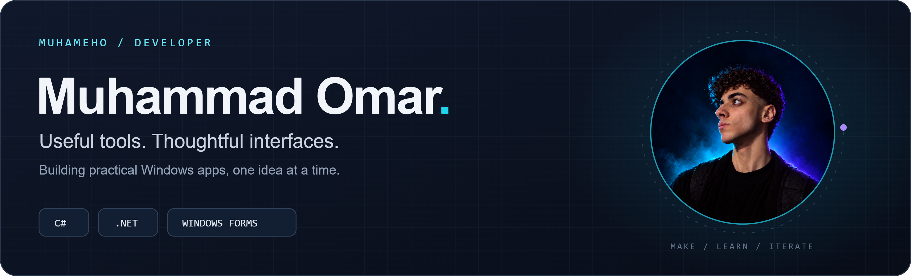

  

  <a href="https://github.com/muhameho?tab=repositories">Explore my projects</a> &nbsp;·&nbsp;
  <a href="https://github.com/muhameho/ColorConvertor/issues">Build something together</a>

### A little about me

I'm **Muhammad Omar**, a developer who builds practical Windows desktop tools with **C# and .NET**. I like turning everyday annoyances into small, focused apps — from picking a color on screen to keeping a note within reach.

My public work explores **Windows Forms**, **desktop productivity**, and **Windows API integration**. Always learning, always making something useful.

### Selected projects

<table>
<tr>
<td width="50%" valign="top">

#### ◈ [Bluri](https://github.com/muhameho/Bluri)

Borderless blur windows that stay above your desktop apps, with opacity control and flexible positioning.

**C# · Windows Forms · Desktop UI**

</td>
<td width="50%" valign="top">

#### ◉ [ColorConvertor](https://github.com/muhameho/ColorConvertor)

Pick colors anywhere on your screen, convert HEX ↔ RGB, and copy the result straight to your clipboard.

**C# · .NET Framework · Windows API**

</td>
</tr>
<tr>
<td width="50%" valign="top">

#### ▤ [StickNi](https://github.com/muhameho/StickNi)

Always-on-top sticky notes with themes and rich text formatting, built to keep ideas visible.

**C# · Windows Forms · Productivity**

</td>
<td width="50%" valign="top">

#### ⌁ [FIN](https://github.com/muhameho/FIN)

Browse a folder and export its file and directory names to a text file, with flexible path options.

**C# · Windows Forms · File Utilities**

</td>
</tr>
</table>

### Contribution Invaders

One year of public GitHub activity, reimagined as a space arcade.

  

Every square is a real day. Brighter cyan means more contributions. Ships and lasers are decorative; the calendar refreshes daily using GitHub Actions.

---

Small tools. Thoughtful details. Built by <a href="https://github.com/muhameho">@muhameho</a>.

